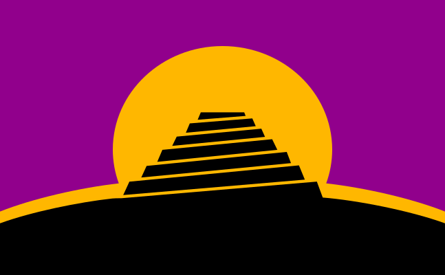

# ConlangFlag

The conlang flag is a symbol of [constructed languages][conlang]. It represents the [Tower of Babel][babel] against the rising sun.

The `<ConlangFlag>` component renders an `<svg>` element.

The `<ConlangFlag>` component forwards its ref to the `<svg>` element.

> The conlang flag was designed by Christian Thalmann, Jan van Steenbergen, Leland Paul, David J. Peterson and Adrian Morgan. It has been released into the public domain.
>
> Further details are available on [the Language Creation Society's website][lcs].

## Props

| Name | Type | Default | Description |
| --- | --- | --- | --- |
| `className` | string | `''` | One or more class names that are forwarded to the `<svg>` element. |
| `width` | number | `94` | The width, in pixels, of the SVG element. |
| `height` | number | `58` | The height, in pixels, of the SVG element. |

Other props are _not_ forwarded to any underlying element.

[conlang]: https://en.wikipedia.org/wiki/Constructed_language
[babel]: https://en.wikipedia.org/wiki/Tower_of_Babel
[lcs]: https://conlang.org/conlang-flag/
