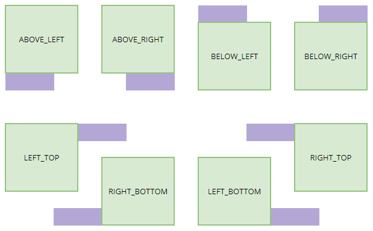

# Menus

* [Examples](#examples)
* [`<Menu>`](#menu)
* [`<Menu.Item>`](#menuitem)
* [`<Menu.CheckItem>`](#menucheckitem)
* [`<Menu.Separator>`](#menuseparator)
* [`<MenuOwner>`](#menuowner)
* [`<MenuTrigger>`](#menutrigger)
* [`<ContextMenuTrigger>`](#contextmenutrigger)

---

The heart of a menu is the [`<Menu>`](#menu) component, which contains any number of menu items and nested submenus. For finer control, a menu (or several) may be placed inside of a [`<MenuOwner>`](#menuowner). Lastly, the [`<MenuTrigger>`](#menutrigger) and [`<ContextMenuTrigger>`](#contextmenutrigger) component helps to manage individual menus and their triggers.

Working with menus can be a bit fiddly. Read the documentation carefully to ensure correct implementation.

## Examples

```jsx
import {Menu, MenuTrigger, Placement, Button, Shortcut} from '@condict/ui';

// A single-level menu attached to a button.
const SettingsShortcut = Shortcut.parse(...);
<MenuTrigger
  menu={
    <Menu>
      <Menu.Item
        label='Reset value'
        onActivate={...}
      />
      <Menu.Item
        label='Delete field'
        onActivate={...}
      />
      <Menu.Separator/>
      <Menu.CheckItem
        label='Enabled'
        checked={...}
        onActivate={...}
      />
      <Menu.Item
        label='More settings...'
        shortcut={SettingsShortcut}
        onActivate={...}
      />
    </Menu>
  }
>
  <Button label='Open menu'/>
</MenuTrigger>

// A menu with submenus.
// Menu items use commands to implement their functionality.
<Menu>
  <Menu.Item icon={<CutIcon/>} label='Cut' command='cut'/>
  <Menu.Item icon={<CopyIcon/>} label='Copy' command='copy'/>
  <Menu.Item icon={<PasteIcon/>} label='Paste' command='paste'/>
  <Menu.Item label='Paste special'>
    <Menu.Item label='Paste as plain text' command='pastePlain'/>
    <Menu.Item label='Paste as image' command='pasteImage'/>
    <Menu.Item label='Paste as raw bytes' command='pasteRaw'/>
  </Menu.Item>
  <Menu.Separator/>
  <Menu.Item label='Undo' command='undo'/>
  <Menu.Item label='Redo' command='undo'/>
  <Menu.Separator/>
  <Menu.Item label='Select all' command='selectAll'/>
</Menu>

// A menu with a radio group. The group has an accessible name.
<Menu>
  <div role='group' aria-label='Text alignment'>
    <Menu.CheckItem
      radio
      label='Align left'
      checked={...}
      onActivate={...}
    />
    <Menu.CheckItem
      radio
      label='Align center'
      checked={...}
      onActivate={...}
    />
    <Menu.CheckItem
      radio
      label='Align right'
      checked={...}
      onActivate={...}
    />
  </div>
</Menu>
```

## `<Menu>`

This component defines a menu – that is, a list of items and possibly nested submenus. This component is _not_ a menu bar; it's only the menu itself.

A `<Menu>` may be the descendant of a [`<MenuOwner>`](#menuowner), in which case that menu owner will own the menu. Mounting a `<Menu>` outside of a `<MenuOwner>` will cause it to construct its own. To open a menu, take a ref to it and call the [`open()`](#menuhandleopen) method on it, or pass it into its owner's [`open()`](#menuownerhandleopen) method.

Menus are rendered using [portals][portal], and as such do not add any DOM elements to their parents.

The `<Menu>` forwards its ref to a [`MenuHandle`](#menuhandle), which exposes an imperative API for opening the menu.

### Props

| Name | Type | Default | Description |
| --- | --- | --- | --- |
| `name` | string | `undefined` | The name of the menu, which can be used to target the menu in [`MenuOwnerHandle.open()`](#menuownerhandleopen). If the name is undefined, the menu cannot be opened by name. |
| `id` | string | `undefined` | The value of the ID attribute attached to the menu. This needs to be provided for the `aria-owns` attribute on the element that owns the menu. |
| `label` | string | `undefined` | The accessible name of the menu, provided to assistive technologies. |
| `onClose` | function | `undefined` | Event handler function that is called when the menu is closed. It receives no arguments. |
| `children` | node | _none; required_ | The items of the menu, usually some combination of [`<Menu.Item>`](#menuitem), [`<Menu.CheckItem>`](#menucheckitem) and [`<Menu.Separator>`](#menuseparator). The menu will render any elements as children, but only the three components just mentioned will be recognised as menu items. Note that they will be recognised even as indirect descendants, i.e., if nested inside other elements. |

Additional props are _not_ forwarded to any underlying element.

## `MenuHandle`

A handle to a [`<Menu>`](#menu), obtained by taking a ref to the menu. It is used to open the menu.

### `MenuHandle.open`

> `open(options: {parent: RelativeParent; placement?: Placement; fromKeyboard?: boolean})`

Opens the menu. If the menu's [owner](#menuowner) already has an open menu, nothing happens. The following options are available:

* `parent` (required): The element, `DOMRect` or point that the menu is placed relative to. This value _must_ contain a visible HTML element, a `DOMRect` or a point (as an object with an `x` and `y` property); otherwise, the menu will not be positioned correctly. If the parent is a `DOMRect` or a point, it will be treated as screen coordinates.
* `placement` (optional): The [placement](#placement) of the menu, relative to its parent. Default:  depends on the writing direction; `'BELOW_LEFT'` in LTR mode, `'BELOW_RIGHT'` in RTL mode.
* `fromKeyboard` (optional): True if the menu was opened from keyboard interaction. Default: false.

There is no corresponding `close` method. Menus can only be closed by user interaction, or by unmounting the menu owner. To be notified when the menu closes, attach an `onClose` prop.

### Placement

The `Placement` type (from `@condict/ui`) is an enumeration of the following values:

* `'ABOVE_LEFT'`: menu is above the parent, horizontally aligned with the parent's left edge.
* `'ABOVE_RIGHT'`: menu is above the parent, horizontally aligned with the parent's right edge.
* `'BELOW_LEFT'`: menu is below the parent, horizontally aligned with the parent's left edge.
* `'BELOW_RIGHT'`: menu is below the parent, horizontally aligned with the parent's right edge.
* `'LEFT_TOP'`: menu is to the left of the parent, vertically aligned with the parent's top edge.
* `'LEFT_BOTTOM'`: menu is to the left of the parent, vertically aligned with the parent's bottom edge.
* `'RIGHT_TOP'`: menu is to the right of the parent, vertically aligned with the parent's top edge.
* `'RIGHT_BOTTOM'`: menu is to the right of the parent, vertically aligned with the parent's bottom edge.

The following picture illustrates the available placements:



## `<Menu.Item>`

The `<Menu.Item>` component represents an activatable menu item. If children are passed to the component, they will be placed inside a submenu of the item. You can attach a [command][] to a menu item, which overrides the `shortcut` and `onActivate` props. The command can also disable the menu item.

When an item has a submenu, note the following:

* The item _should not_ have a shortcut. If the item has a command, its shortcut, if any, _is_ shown.
* The `onActivate` prop is _not_ called when the menu item is clicked or the submenu opens. Likewise, if the item has a command, it is not executed.
* The `disabled` prop _is_ honoured, even if it comes from an attached command.

To define a checkable menu item (checkbox or radio item), use [`<Menu.CheckItem>`](#menucheckitem).

The `<Menu.Item>` component forwards its ref to the outer element (a `<div>`).

### Props

| Name | Type | Default | Description |
| --- | --- | --- | --- |
| `label` | string | _none; required_ | The text label of the menu item. |
| `icon` | node | `null` | The icon of the menu item, shown before the label. The menu item is specifically designed to work with icons from the [mdi-react][] package; other icon sets will not be correctly styled. |
| `shortcut` | [Shortcut][] | `null` | The shortcut associated with the menu item. This value is used for display and accessibility only; it does not attach any behaviour. If the menu item has a [command][], this prop is ignored. |
| `disabled` | boolean | `false` | If true, the menu item is disabled. If the menu item has a [command][], the command can also disable the menu item. |
| `command` | string | `null` | Attaches the named [command][] to the menu item. The command overrides the `disabled`, `shortcut` and `onActivate` props. |
| `onActivate` | function | no-op | Event handler function for when the menu item is activated. It receives no arguments, and the return value is ignored. If the menu item has a [command][], this prop is ignored. This function is not invoked on items with submenus. |
| `children` | node | `undefined` | If present, contains the items of a submenu attached to this menu item. Note that this prop takes the _items_ of the submenu, not a `<Menu>` element. It takes the same children as the [`<Menu>`](#menu) component. Menu items with submenus should not have a shortcut. |

Other props are _not_ forwarded to any underlying element.

## `<Menu.CheckItem>`

The `<Menu.CheckItem>` component represents a checkable menu item. It can be either a checkbox or a radio menu item. A group of related radio menu items should be placed inside an element with `role="group"` for accessibility.

Checkable menu items cannot have a submenu. Any children passed to the component will be ignored.

Checkable menu items do _not_ render an underlying `<input>` and so cannot be submitted as part of a form.

The `<Menu.CheckItem>` component forwards its ref to the outer element (a `<div>`).

### Props

| Name | Type | Default | Description |
| --- | --- | --- | --- |
| `label` | string | _none; required_ | The text label of the menu item. |
| `icon` | node | `null` | The icon of the menu item, shown before the label. The menu item is specifically designed to work with icons from the [mdi-react][] package; other icon sets will not be correctly styled. |
| `shortcut` | [Shortcut][] | `null` | The shortcut associated with the menu item. This value is used for display and accessibility only; it does not attach any behaviour. If the menu item has a [command][], this prop is ignored. |
| `checked` | boolean | `false` | Determines whether the menu item is checked. |
| `radio` | boolean | `false` | If true, the menu item is drawn as a radio button instead of a checkbox. Radio menu items should be placed inside an element with `role="group"` for accessibility. |
| `disabled` | boolean | `false` | If true, the menu item is disabled. If the menu item has a [command][], the command can also disable the menu item. |
| `command` | string | `null` | Attaches the named [command][] to the menu item. The command overrides the `disabled`, `shortcut` and `onActivate` props. |
| `onActivate` | function | no-op | Event handler function for when the menu item is activated. It receives no arguments, and the return value is ignored. If the menu item has a [command][], this prop is ignored. |

Other props are _not_ forwarded to any underlying element.

## `<Menu.Separator>`

A non-interactive horizontal line that separates groups of related menu items. It should not occur as the first or last item of a menu.

The `<Menu.Separator>` component does _not_ forward its ref to any underlying element.

### Props

None. Any props passed to the component are ignored.

## `<MenuOwner>`

This is an uncontrolled component that owns and manages a set of menus. It attaches global event listeners to handle mouse movements, keyboard input, and other events required to implement the menu tree.

The `<MenuOwner>` component exposes an imperative API for opening menus; see [the `open` method](#menuownerhandleopen). To access the API, take a ref to the menu owner.

This component does not render a DOM node of its own; it simply returns its child. Any menu to be owned by the component must be a descendant of the menu owner, as the owner relies on context values to communicate with its menus.

### Props

| Name | Type | Default | Description |
| --- | --- | --- | --- |
| `onCloseRoot` | function | no-op | A function that is called when the root (top-level) menu is closed. |
| `children` | node | `undefined` | Any React node. The menu owner can only manage menus that appear as descendants of it; hence, a owner's children should include a [`<Menu>`](#menu) somewhere. |

Other props are _not_ forwarded to any underlying element, because a menu owner has no elements of its own.

## `MenuOwnerHandle`

A handle to a [`<MenuOwner>`](#menuowner), obtained by taking a ref to the menu owner. It is used to open menus under the owner.

### `MenuOwnerHandle.open`

> `open(options: {name?: string | null; parent: RelativeParent; placement?: Placement; fromKeyboard?: boolean})`

This imperative method opens the given [`Menu`](#menu). If the owner already has an open menu, it will be closed. The following options are available:

* `name` (optional): The name of the menu to open, corresponding to the menu's `name` prop. If omitted, the first registered menu is opened.
* `parent` (required): The element, `DOMRect` or point that the menu is placed relative to. This value _must_ contain a visible HTML element, a `DOMRect` or a point (as an object with an `x` and `y` property); otherwise, the menu will not be positioned correctly. If the parent is a `DOMRect` or a point, it will be treated as screen coordinates.
* `placement` (optional): The [placement](#placement) of the menu, relative to its parent. Default: depends on the writing direction; `'BELOW_LEFT'` in LTR mode, `'BELOW_RIGHT'` in RTL mode.
* `fromKeyboard` (optional): True if the menu was opened from keyboard interaction. Default: false.

There is no corresponding `close` method. Menus can only be closed by user interaction, or by unmounting the menu owner. To be notified when the root menu closes, attach an `onCloseRoot` prop.

## `<MenuTrigger>`

The `<MenuTrigger>` component is used to attach a menu to a component. It is currently quite an inflexible component, and several requirements must be met for correct operation. In practice it is only really usable with something that behaves like a button. Using [`React.cloneElement`][cloneelement], the menu trigger does the following:

* Attaches a unique, random `id` to the menu;
* Attaches a ref to the trigger element (any existing ref will still be called/updated);
* Adds an `onClick` prop to the trigger element, which opens the menu (any existing `onClick` handler will _not_ be called);
* Adds the `aria-owns` and `aria-haspopup="menu"` props to the trigger element;
* Adds the trigger's `openClass` to the trigger element's `className` (any existing classes are preserved); and
* Wraps the menu in a [`<MenuOwner>`](#menuowner).

The end result is that the trigger element opens the menu when clicked, and it reports correct accessibility information about the presence of a menu.

For finer control of menus, you must implement some or all of the above yourself.

The `<MenuTrigger>` component does _not_ forward its ref to any underlying element.

### Props

| Name | Type | Default | Description |
| --- | --- | --- | --- |
| `menu` | element | _none; required_ | Any React element that renders a [`<Menu>`](#menu). It must take an `id` prop, whose value must be forwarded to the `<Menu>`. |
| `openClass` | string | `menu-open` | A class name (or list of space-separated class names) that are passed to the trigger element's `className` when the menu is open. Note: the default value is used when `undefined` is passed. To disable class name injection, use `openClass=''`. |
| `onToggle` | function | no-op | A function that is called when the menu opens or closes. This can be used to track the state of the menu in the trigger component. It receives a single boolean argument which is `true` if the menu just opened, `false` if it just closed. The return value is ignored. |
| `children` | element | _none; required_ | A single React element (but not other renderable) whose ref resolves to a DOM element. This becomes the menu trigger. The element must support an `onClick` event handler, along with the `aria-owns` and `aria-haspopup` props. The menu is positioned relative to the element in the ref. |

Other props are _not_ forwarded to any underlying element.

## `<ContextMenuTrigger>`

The `<ContextMenuTrigger>` component is similar to [`<MenuTrigger>`](#menutrigger), but as its name suggests, is used to attach a context menu. Context menus are typically triggered by right-clicking or pressing the menu button on the keyboard. Using [`React.cloneElement`][cloneelement], the context menu trigger does the following:

* Attaches a unique, random `id` to the menu;
* Attaches a ref to the trigger element (any existing ref will still be called/updated);
* Adds an `onContextMenu` prop to the trigger element, which, when called, cancels the default behaviour and opens the custom context menu (any existing `onContextMenu` handler will _not_ be called);
* Adds the `aria-owns` prop to the trigger element;
* Adds the trigger's `openClass` to the trigger element's `className`, if specified (any existing classes are preserved); and
* Wraps the menu in a [`<MenuOwner>`](#menuowner).

The menu is positioned relative to the pointer when opened by right-clicking, and relative to the trigger element when opened by keyboard.

For finer control of context menus, you must implement some or all of the above yourself.

### Props

| Name | Type | Default | Description |
| --- | --- | --- | --- |
| `menu` | element | _none; required_ | Any React element that renders a [`<Menu>`](#menu). It must take an `id` prop, whose value must be forwarded to the `<Menu>`. |
| `openClass` | string | `undefined` | If specified, contains a class name (or list of space-separated class names) that are passed to the trigger element's `className` when the menu is open. |
| `onToggle` | function | no-op | A function that is called when the menu opens or closes. This can be used to track the state of the menu in the trigger component. It receives a single boolean argument which is `true` if the menu just opened, `false` if it just closed. The return value is ignored. |
| `children` | element | _none; required_ | A single React element (but not other renderable) whose ref resolves to a DOM element. This becomes the menu trigger. The element must support an `onContextMenu` event handler, along with the `aria-owns` prop. The menu is positioned relative to the element in the ref when opened by keyboard. |

Other props are _not_ forwarded to any underlying element.

[mdi-react]: https://www.npmjs.com/package/mdi-react
[portal]: https://reactjs.org/docs/portals.html
[cloneelement]: https://reactjs.org/docs/react-api.html#cloneelement
[command]: ../command
[shortcut]: ../shortcut
